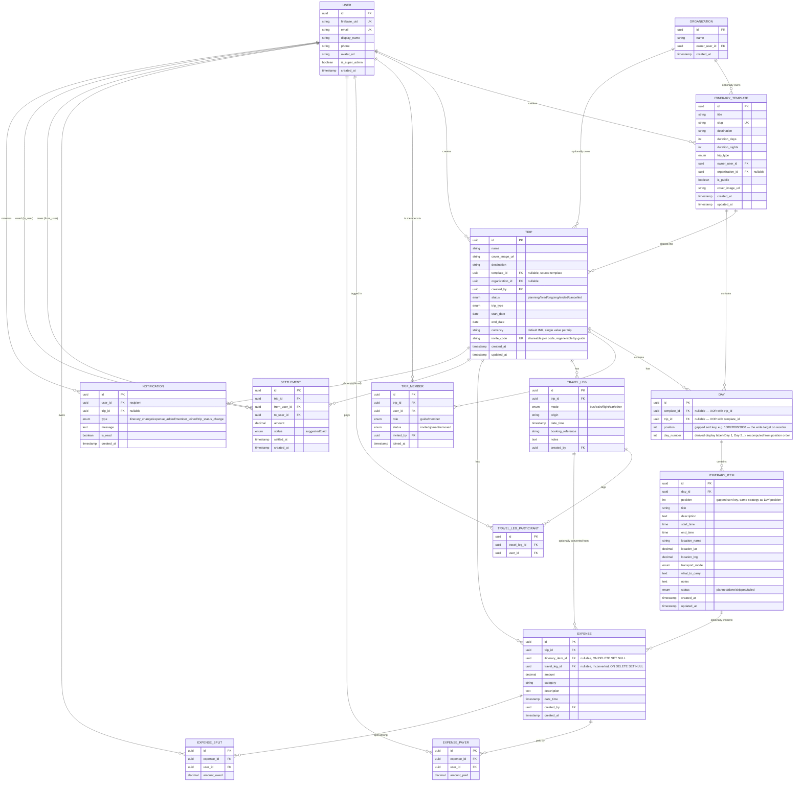

# VoTrip — Software Requirements Specification (SRS)

**Document version:** 1.0
**Companion to:** 01-PRD.md, 03-TechStack.md

---

## 1. System overview

VoTrip is a web + mobile (iOS/Android) application backed by a single REST API. See 03-TechStack.md for the full architecture; this SRS is stack-agnostic on purpose.

## 2. User roles & permissions

| Action | SuperAdmin | Trip Guide | Member |
| --- | --- | --- | --- |
| View all trips (platform-wide) | ✅ | ❌ (own trips only) | ❌ (joined trips only) |
| Create itinerary template | ✅ | ✅ | ❌ |
| Create trip from template | ✅ | ✅ | ❌ |
| Edit trip itinerary | ✅ | ✅ | ❌ (view + mark item status only) |
| Invite/remove members | ✅ | ✅ | ❌ |
| Add expense | ✅ | ✅ | ✅ |
| Edit/delete own expense | ✅ | ✅ | ✅ (own entries) |
| Mark item status | ✅ | ✅ | ✅ (fixed permission, not per-trip configurable — see PRD 4.3) |
| Change trip lifecycle status | ✅ | ✅ | ❌ |

## 3. Functional requirements

### FR-1: Authentication

- FR-1.1: Email/password and social login (Google minimum)
- FR-1.2: Single account can hold different roles on different trips
- FR-1.3: Password reset, email verification

### FR-2: Itinerary Templates

- FR-2.1: Template = ordered list of Days; each Day = ordered list of Items
- FR-2.2: Template is owned by a Trip Guide (or Organization, field reserved for future)
- FR-2.3: Cloning a template into a Trip creates an independent copy — no live link back to the template

### FR-3: Trips

- FR-3.1: Trip has: name, cover image, start/end date, status, guide(s), members, itinerary (cloned or blank), currency (fixed INR for MVP)
- FR-3.2: Trip status enum: `PLANNING → FIXED → ONGOING → ENDED`, with `CANCELLED` reachable from any pre-ENDED state
- FR-3.3: Trip type tag: `road_trip | bike_trip | mixed | custom` — informational only in MVP (no behavior difference), reserved for future filtering/AI use
- FR-3.4: Members join via a shareable trip link/code by default (instant, no approval); a guide may additionally send explicit invites to specific people (email/phone), which require acceptance. Both paths result in the same `TRIP_MEMBER` record shape.

### FR-4: Itinerary Items

- FR-4.1: Each item belongs to exactly one Day, has an explicit order/position
- FR-4.2: Fields: title, description, date + start/end time, location (name + lat/long + Google Maps deep link), transport mode for that segment (walk/local transit/rented car/2-wheeler/other), "what to do," "what to carry," free-form notes/ideas, status (`planned | done | skipped | failed`)
- FR-4.3: Items are reorderable via drag-and-drop within a day and across days, on web and mobile
- FR-4.4: Reordering must be resilient to concurrent edits (two people editing at once) — last-write-wins is acceptable for MVP, but must not corrupt ordering (no duplicate/missing position values)

### FR-5: Member Travel Logistics

- FR-5.1: Each Member may optionally log: mode of transport to reach the destination, date/time, origin, ticket/booking reference (free text)
- FR-5.2: A travel entry can tag multiple Members as co-travelers (shared ticket/cab)
- FR-5.3: A tagged shared travel entry can be converted into a Splitwise expense in one action (pre-fills payer/participants)

### FR-6: Expenses (Splitwise module)

- FR-6.1: Expense fields: amount, paid-by (one or more payers with amounts), split-among (equal or custom amounts), date/time, category, optional link to a specific Itinerary Item
- FR-6.2: Running per-member balance, computed trip-wide
- FR-6.3: Settle-up view: simplified minimum-transaction suggestions (e.g., "A pays B ₹500" instead of a full pairwise ledger)
- FR-6.4: Marking a suggested settlement as "paid" is a manual confirmation, not a payment integration
- FR-6.5: Expense history filterable by date and by itinerary item

### FR-7: Notifications

- FR-7.1: In-app notification on: itinerary change, new expense, member joined, trip status change — backed by the `NOTIFICATION` entity (see ERD, section 5)
- FR-7.2: Push notifications (FCM) — fast-follow, not MVP-blocking

## 4. Non-functional requirements

| Category | Requirement |
| --- | --- |
| Security | All traffic HTTPS; JWT-based auth with short-lived access + refresh tokens; role checks enforced server-side on every endpoint, never trusted from client |
| Scalability | Stateless backend (horizontally scalable on Cloud Run); DB access patterns designed to avoid N+1 queries on itinerary/expense reads |
| Availability | No formal SLA for MVP (side project scale), but no single point of failure in the reordering/expense-write path that could corrupt data |
| Performance | Itinerary and expense screens must load in under ~1.5s on average mobile network conditions |
| Data integrity | Itinerary reordering and expense splits must be transactional — a failed request must never leave partial/corrupt state |
| Auditability | Every expense and status change stores who/when (for trust in a group-money context) |

## 5. Entity-Relationship Diagram

This is the real schema the backend will be built against — the flat entity list from earlier drafts is superseded by this.

### Constraints not expressible in the diagram itself

**Uniqueness (composite):**

- `TRIP_MEMBER(trip_id, user_id)` — a user can't have two membership rows on the same trip
- `TRAVEL_LEG_PARTICIPANT(travel_leg_id, user_id)` — no duplicate tags on the same leg
- `EXPENSE_PAYER(expense_id, user_id)` — one payer row per person per expense
- `EXPENSE_SPLIT(expense_id, user_id)` — one split row per person per expense
- `ITINERARY_ITEM(day_id, position)` — prevents two items in the same day from silently landing on the same sort position under concurrent writes; a collision fails the write, and the backend retries with a freshly recalculated position rather than corrupting order (this is what actually satisfies FR-4.4, not just "last-write-wins" as a hand-wave)
- `DAY(template_id, position)` and `DAY(trip_id, position)` — same reasoning, one level up

**Check constraints:**

- `DAY`: exactly one of `template_id` / `trip_id` is non-null (XOR)
- `SETTLEMENT`: `from_user_id != to_user_id`
- `EXPENSE.amount > 0`, `EXPENSE_PAYER.amount_paid >= 0`, `EXPENSE_SPLIT.amount_owed >= 0` — no negative money values

**Cascade-delete rules (financial data must never silently disappear):**

- `EXPENSE.itinerary_item_id → ITINERARY_ITEM.id`: **`ON DELETE SET NULL`**, not `CASCADE` — deleting an itinerary item must never delete the money record tied to it, only unlink it
- `EXPENSE.travel_leg_id → TRAVEL_LEG.id`: **`ON DELETE SET NULL`**, same reasoning
- `DAY → ITINERARY_ITEM`: `CASCADE` is fine here — deleting a whole day legitimately removes its items (the expense protection above already covers the money side)
- `USER` rows are never hard-deleted in the MVP — accounts are deactivated (a flag), not removed — since almost every table above holds a `user_id` FK that financial/historical records depend on

**Money field types:** all `amount` / `amount_paid` / `amount_owed` columns are `DECIMAL(10,2)`, never `FLOAT` — floating point rounding errors are unacceptable in a shared-expense ledger.

**Position rebalancing:** gapped sort keys (e.g. 1000/2000/3000) will eventually run out of room if items keep getting inserted between the same two neighbors repeatedly. The backend needs a rebalancing routine — renumber all positions in a `Day`/`Trip` back to clean, evenly-spaced values — triggered either periodically or when the gap between two adjacent positions drops below a threshold (e.g. < 2).

**Itinerary items crossing midnight:** an item with `end_time < start_time` (e.g. 11:00 PM – 2:00 AM) is a valid real-world case, not an error. The service layer must treat this explicitly as "ends on the following calendar day" rather than rejecting it or silently computing a negative duration.

**Trip joining (both mechanisms, per product decision):**

- **Shareable link/code (default):** `TRIP.invite_code` — anyone with the code self-joins, creating a `TRIP_MEMBER` row directly with `status='joined'`, `role='member'`, no approval step. The guide can regenerate the code at any time, which invalidates the old one (old links stop working, already-joined members are unaffected).
- **Explicit invite (optional):** guide invites a specific person by email/phone → creates a `TRIP_MEMBER` row with `status='invited'` → becomes `'joined'` once that person accepts. This is the flow `TRIP_MEMBER.invited_by` and the `'invited'` status exist for.
- Both mechanisms write to the same `TRIP_MEMBER` table — there's no schema fork, just two different code paths that create/update rows in it.

**A trip must always retain at least one active guide.** Removing the last remaining `TRIP_MEMBER` row with `role='guide'` on a trip must be blocked at the service layer — either reject the removal or require promoting another member to guide first. This isn't a DB constraint (hard to express "at least one row of type X" declaratively in Postgres) — it's a business rule the service layer must enforce explicitly.

### Key design decisions worth knowing about later

- **`DAY` is shared between templates and trips** (nullable `template_id`/`trip_id`, exactly one set — enforced with a DB check constraint) instead of two separate tables. This keeps cloning simple: copying a template's Days/Items into a Trip is a straightforward row-copy with the FK swapped, not two parallel schemas to keep in sync.
- **`position` is a gapped sort key, not a tight sequence** — reordering a day or item just needs a new value between its new neighbors (e.g. moving between position 1000 and 2000 → write 1500), avoiding a cascade of renumbering writes across every other row on every drag-drop action. `day_number` (and calendar date, computed as `trip.start_date + day_number`) are derived display values recalculated from position order, not the write target.
- **`EXPENSE_PAYER` and `EXPENSE_SPLIT` are separate tables**, not columns on `EXPENSE` — this is what makes "multiple people paid, split unevenly among a different set of people" possible without special-casing, and it's exactly the shape Splitwise itself uses internally.
- **`SETTLEMENT` rows are generated, not source-of-truth** — they're the output of running the debt-simplification algorithm over `EXPENSE_SPLIT`/`EXPENSE_PAYER` data, recomputed on demand, with `status` tracking manual "mark as paid" confirmations.
- **No separate audit-log table for MVP** — `created_by`/`created_at`/`updated_at` on the mutable tables satisfies the auditability requirement without the overhead of a full event-sourcing/audit system, which would be overkill at this scale.
- **`ORGANIZATION` is fully wired into the schema but unused in the UI** — exactly as planned in the forward-compatibility notes below.
- **Trip creation auto-inserts a `TRIP_MEMBER` row with `role='guide'` for the creator** — access-control checks always query `TRIP_MEMBER`, never `Trip.created_by` directly. This also means co-guides (PRD says "guide(s)," plural) are already supported by the schema with zero extra work — just another `TRIP_MEMBER` row with `role='guide'`.
- **`EXPENSE.amount` has no `currency` field** — currency lives once on `TRIP` (MVP is single-currency per trip), so every expense inherits it implicitly. Re-add per-expense currency only if/when multi-currency is actually built.
- **`NOTIFICATION` is its own table**, not folded into any other entity — every notification is a row (recipient, optional trip context, type, read/unread), which keeps the in-app notification feed a simple indexed query (`WHERE user_id = ? AND is_read = false`) rather than something derived from scanning other tables' timestamps.

## 6. Assumptions & constraints

- Single currency (INR) for MVP
- Trips are invite-only; no public discovery in MVP
- No real-time collaborative editing (e.g., simultaneous drag-drop by two guides) — MVP treats it as low-frequency enough that last-write-wins is acceptable
- Mobile app requires an internet connection

## 7. Forward-compatibility notes (for the two future features, not built now)

- **AI planner**: keep itinerary generation logic behind a single service boundary (e.g., `ItineraryService.generateFromTemplate()` / a future `generateFromPrompt()`) so an AI-backed generator can be swapped in without touching the Item/Day data model
- **Org marketplace**: `Organization` entity exists in the schema from day one (nullable owner on Template/Trip); no UI, no billing, no storefront — just enough to avoid a migration later
