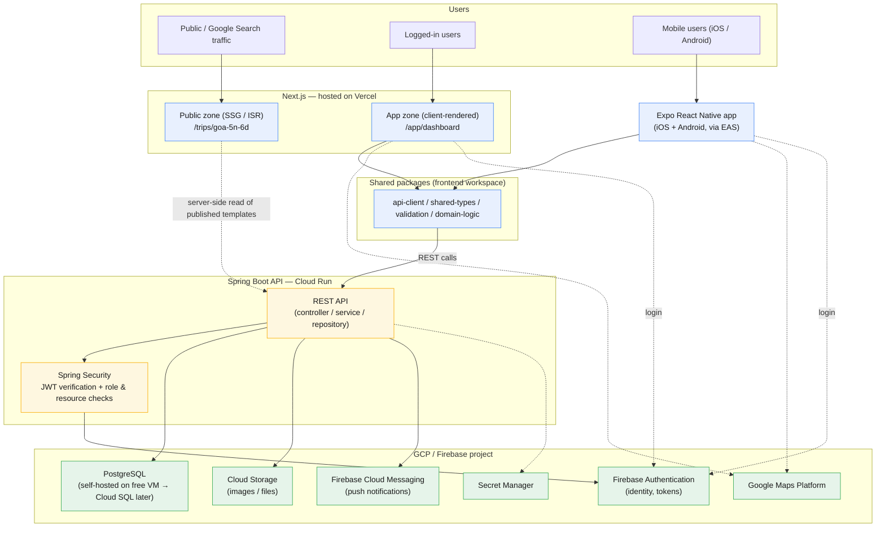

# VoTrip — Tech Stack & Architecture Document

**Document version:** 1.1
**Companion to:** 01-PRD.md, 02-SRS-ERD.md
**Purpose:** Record *what* we're using, *why*, and *how the pieces talk to each other* — so this is still legible to you (or an AI agent) six months from now.

---

## Changelog

- **1.1** — §3 revised: switched from two separate repositories to a single
  repository containing `backend/` and `frontend/`. Reasoning: VoTrip is
  being built solo with Claude Code as the primary implementer, and most
  real features are vertical (touch an endpoint, a DTO, shared types, and
  UI in the same change) — a single repo lets one session/PR implement a
  full vertical slice and keeps the API contract and its consumers from
  drifting apart silently. Deployment, linting, and CI remain fully
  independent per side (path-scoped GitHub Actions); only the repo and
  git history are shared. Nothing else in this document changed.
- **1.0** — Initial version.

---

## 1. Guiding principles behind every choice below

1. **Free-first, pay only when it's justified by real users** — every core service has a genuine free tier we can live on for MVP
2. **Low operational hassle** — prefer managed/serverless over self-managed wherever the free tier allows it, except where self-hosting is trivial and saves real money (e.g. one Postgres VM)
3. **One ecosystem where it doesn't cost extra convenience** — GCP/Firebase for almost everything; Vercel is the one deliberate exception, because it's the best possible fit for Next.js specifically
4. **SEO on the public web, none of that overhead on the app** — this is *why* the web stack looks the way it does
5. **Secure by default** — auth/authz enforced server-side always, HTTPS everywhere, no secrets in client code

---

## 2. High-level architecture



Both clients (web app-zone and mobile) talk to the **same Spring Boot REST API** — there is only ever one backend, one source of truth. The public SEO pages on Next.js can also read published template data directly (server-side) for fast static generation, without going through client-side auth. Firebase Auth only proves *who* the user is; every *what-are-they-allowed-to-do* check happens inside Spring Boot, never trusted from the client.

---

## 3. Repository layout

**One repository, two applications with independent toolchains.**

Java/Spring Boot and the TypeScript frontend don't share a build pipeline —
they lint, test, and deploy completely independently — but they *do* share
a single git history and a single PR flow. For a solo build (or a small
team using an AI coding agent as the primary implementer), most real
features are vertical slices: an endpoint, its DTO, the shared TypeScript
type, the typed API client call, and the UI that uses it, all in one
change. Splitting that across two repos means manually keeping a contract
in sync by hand across two PRs; keeping it in one repo means one PR *is*
the contract, front to back.

```
VoTrip/
├── docs/                      → 01-PRD.md, 02-SRS-ERD.md, 03-TechStack.md, 04-FutureScope.md
├── CLAUDE.md                  → guidance for Claude Code (both sides)
├── AGENTS.md                  → condensed guidance for other coding agents
├── CONTRIBUTING.md            → branching, CI, PR conventions
│
├── backend/                   → Spring Boot, Maven
│   ├── docker-compose.yml     → local Postgres
│   ├── pom.xml
│   └── src/main/java/com/votrip/
│       ├── config/            → Spring Security, Firebase Admin SDK init
│       ├── common/            → @ControllerAdvice, shared exceptions, base entities
│       ├── user/
│       ├── trip/
│       ├── itinerary/         → Day + ItineraryItem
│       └── expense/
│           # each domain: controller / service / repository / dto / entity
│
└── frontend/                  → Turborepo, pnpm workspaces
    ├── turbo.json
    ├── pnpm-workspace.yaml
    ├── apps/
    │   ├── web/                → Next.js (public SEO pages + authenticated app)
    │   └── mobile/              → Expo (React Native, iOS + Android)
    └── packages/
        ├── shared-types/        → Trip, Itinerary, Expense, User type definitions
        ├── api-client/          → typed functions calling the Spring Boot API
        ├── validation/          → Zod schemas (expense splits, itinerary items, etc.)
        └── domain-logic/        → settle-up algorithm, drag-drop position math, date formatting
```

**What staying independent actually means in practice:**

- **Deployment** stays fully separate — Vercel points at the `frontend/apps/web`
  subdirectory, Cloud Run's Dockerfile lives in `backend/`, EAS builds from
  `frontend/apps/mobile`. Neither deploy pipeline knows or cares that a
  sibling folder exists.
- **CI** is path-scoped (GitHub Actions `paths: ['backend/**']` /
  `paths: ['frontend/**']`) so a backend-only change never triggers a
  pnpm build, and vice versa — see `CONTRIBUTING.md`.
- **Dependencies** never mix — `backend/pom.xml` and `frontend/package.json`
  are entirely separate dependency trees.

**When this would be worth revisiting:** if a dedicated backend contractor
ever needs repo access without seeing the frontend, or if the two sides'
release cadence diverges enough that a shared history becomes noisy rather
than useful. Not a concern at MVP scale.

---

## 4. Web frontend — Next.js

**Why:** it's the only framework that cleanly does both jobs you need — statically generated, SEO-crawlable public pages *and* a fully interactive authenticated app — in one codebase, without bolting two frameworks together.

**How it's structured internally:**

- **Public zone** (`app/(public)/trips/[slug]/page.tsx`): rendered with SSG at build time for default templates, ISR (`revalidate`) so updates to a published template refresh the page without a full redeploy. No auth required, fast, indexable.
- **App zone** (`app/(dashboard)/...`): client-rendered, wrapped in an auth guard, calls the Spring Boot API via `packages/api-client`. SEO is irrelevant here — treat it like a normal SPA.
- **SEO mechanics**: Next.js Metadata API for per-page titles/OG tags, auto-generated `sitemap.xml`, JSON-LD structured data (`schema.org/TouristTrip`) on template pages, clean URL scheme (`/trips/goa-5n-6d`).

**Deployment:** **Vercel**, free tier. Deliberate exception to "everything on GCP" — Vercel is built by the Next.js team and is genuinely the lowest-hassle option for this specific framework. Auto-deploys on git push (scoped to `frontend/apps/web`), free SSL, free CDN, generous bandwidth on the free tier.

---

## 5. Mobile — React Native (Expo)

**Why:** one codebase → both iOS and Android, huge ecosystem, easiest realistic path for a solo developer to ship to both stores without maintaining two native codebases.

**How:**

- Standard Expo-managed workflow (not bare) unless a specific native module forces an eject later
- Talks to the same Spring Boot API through the shared `api-client` package
- Firebase SDKs (Auth, Cloud Messaging) used directly via `@react-native-firebase` or Expo's Firebase integration
- **Build/deploy:** **EAS (Expo Application Services)** — free tier covers a limited number of builds/month, enough for MVP development cadence; paid tier only needed once you're shipping frequent releases to app stores at scale

---

## 6. Shared packages (the "FE business logic" layer)

| Package | Contains | Why shared |
| --- | --- | --- |
| `shared-types` | Trip, ItineraryItem, Expense, User, Role type defs | One definition, both clients get compile-time errors if they drift from the backend contract |
| `api-client` | Typed functions per endpoint (`addExpense()`, `reorderItinerary()`, etc.) | No risk of web and mobile silently calling the API differently |
| `validation` | Zod schemas (split sums, item date ranges) | Money and scheduling correctness enforced identically on both platforms |
| `domain-logic` | Settle-up simplification algorithm, drag-drop position recalculation, date/timezone formatting | Pure logic, no UI — written and tested once instead of twice |

UI components, navigation, and screens are **not** shared — web and mobile UIs are built independently, as decided.

---

## 7. Backend — Spring Boot

**Why:** this is your strongest existing skill (same stack you run in production at FedEx) — fastest realistic build velocity, and it's resume/interview-relevant, unlike outsourcing everything to a BaaS.

**How:**

- Modular monolith for MVP — one deployable, clean package-per-domain, no premature microservices split
- Spring Security validates Firebase-issued JWTs on every request (Firebase Auth is the identity provider; Spring Boot never re-implements auth, only verifies tokens and enforces role/permission checks server-side)
- REST API, versioned (`/api/v1/...`)
- Exception handling via `@ControllerAdvice`, consistent error response shape for both clients to parse
- **Deployment:** containerized (Docker), deployed to **Cloud Run** — free up to 2M requests/month, scales to zero when idle, scales up automatically under load without any manual intervention later

---

## 8. Database — PostgreSQL

**Why Postgres specifically:** relational data (trips, itinerary items with strict ordering, expenses with splits that must sum correctly) fits relational integrity constraints far better than a NoSQL document store — and it's what you already run in production.

**How (staged approach):**

- **MVP stage:** self-hosted Postgres via Docker on the GCP **Always Free e2-micro VM** — genuinely $0 forever, acceptable ops burden given you already run Docker in production
- **Growth stage:** migrate to **Cloud SQL for PostgreSQL** (~$8-10/month smallest tier) once you want managed backups, high availability, and one less thing to personally maintain — this is a lift-and-shift, not a rewrite, since it's the same Postgres

---

## 9. Auth & Authorization

**Why Firebase Auth over self-hosted Keycloak:** for a solo-built MVP, managed auth (social login, password reset, mobile SDKs, session handling) shipped for you is a large time save over standing up and maintaining Keycloak — even though you know Keycloak well from work. Free up to 50,000 monthly active users, which is far beyond MVP scale.

**How:**

- Firebase Auth issues ID tokens (JWTs) after login (email/password or Google sign-in)
- Both Next.js (app zone) and Expo attach the token to every API request
- Spring Boot validates the token signature/expiry via Firebase Admin SDK, then applies **authorization** itself: role checks (SuperAdmin / Trip Guide / Member) and resource-level checks (e.g., "is this user actually a member of this trip?") happen entirely in Spring Security / service-layer code — Firebase only proves *who* the user is, never *what they're allowed to do*

---

## 10. Supporting services

| Need | Service | Why |
| --- | --- | --- |
| File/image storage (trip covers, itinerary photos) | **Cloud Storage** | Same GCP project, generous free tier |
| Maps (location pins, "open in Google Maps" links) | **Google Maps Platform** | Same billing account, monthly free credit, natural fit for a trip app |
| Push notifications | **Firebase Cloud Messaging** | Free, works across iOS/Android via Expo |
| Secrets (API keys, DB credentials) | **Secret Manager** | Keeps credentials out of git and out of client bundles |
| CI/CD | **GitHub Actions** | Free minutes for a project this size; path-scoped workflows build/test backend and frontend independently on every push |
| Monitoring/logs | **Cloud Logging + Monitoring** | Included free with GCP, enough visibility for MVP scale |

---

## 11. Security checklist (applies across every layer above)

- HTTPS enforced everywhere (Vercel and Cloud Run both provide this by default)
- JWT verified server-side on **every** API call — client-reported role/identity is never trusted
- Resource-level authorization (not just role checks) — a Member must be checked as an actual participant of a specific trip before they can read/write its data
- No secrets committed to the repo — all via Secret Manager / environment variables injected at deploy time
- Input validation duplicated intentionally: `validation` package on the frontend (fast UX feedback) **and** the same rules re-enforced in Spring Boot (never trust client-side validation alone)

---

## 12. Cost snapshot

| Stage | Monthly cost |
| --- | --- |
| MVP (building, testing, early users) | ₹0 (only real cost: domain registration, ~₹700-1000/year) |
| Early growth (few hundred active users) | Still likely ₹0-500/month — free tiers cover this comfortably |
| Real growth (paying customers / ad revenue justifies it) | Cloud SQL (~₹800/mo), Cloud Run beyond free quota, Vercel Pro if needed — scales with actual revenue, not before |

---

## 13. What we deliberately did *not* choose, and why

- **Keycloak self-hosted** — more control, but real ops overhead for a solo MVP; revisit only if Firebase Auth's limits or pricing become a problem at scale
- **Firebase Hosting for the web app instead of Vercel** — technically keeps everything in one vendor, but Vercel's Next.js support is more mature and genuinely lower-hassle; the one extra free account is worth it
- **Full UI sharing via react-native-web** — real complexity for uncertain payoff at MVP stage; revisit later if screen-logic duplication becomes a measurable pain point
- **Microservices from day one** — adds coordination overhead with no present benefit; the modular monolith can be split later exactly where growth actually demands it (you already have Kafka/RabbitMQ experience for that transition when it comes)
- **Two separate repositories (backend vs. frontend)** — considered and rejected in favor of one repo with independent `backend/`/`frontend/` toolchains (see §3 and the 1.1 changelog entry). Revisit only if repo access needs to be restricted per-contributor or release cadence genuinely diverges.
